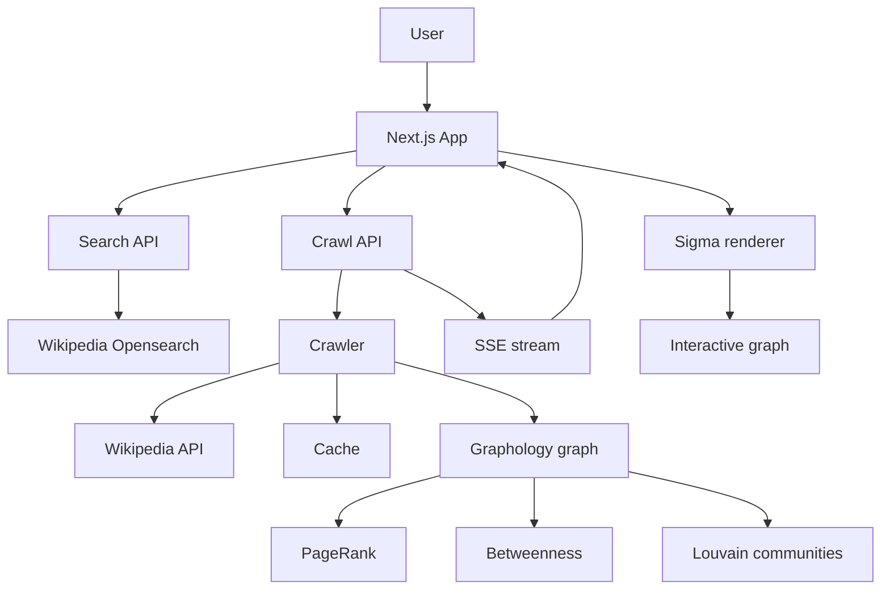

# WikiCrawl

<p align="center">
  
</p>

<p align="center">
  <strong>Turn Wikipedia's hyperlinks into a map you can explore.</strong>
</p>

<p align="center">
  <a href="https://wiki-crawl.vercel.app">Live Demo</a>
  ·
  <a href="https://github.com/Adityavardhanjain/WikiCrawl">Source Code</a>
  ·
  <a href="https://github.com/Adityavardhanjain/WikiCrawl/issues">Issues</a>
</p>

<p align="center">
  
  
  
  
  
</p>

---

## Explore the Wikipedia Rabbit Hole

Wikipedia is not just a collection of pages. It is a huge network of ideas connected by hyperlinks.

**WikiCrawl** makes that network visible.

Start with any Wikipedia article and WikiCrawl crawls outward through related pages, builds a directed knowledge graph, analyzes the structure of that graph, and renders the result as an interactive map.

Instead of reading one page at a time, you can **see neighborhoods of knowledge, discover bridge pages, follow connections, and wander down a rabbit hole on purpose.**

> **Search → Crawl → Analyze → Explore → Expand**

### Live demo

**[Open WikiCrawl →](https://wiki-crawl.vercel.app)**

---

## Screenshots

### 01 · Start with any topic

The landing experience is deliberately lightweight: pick an article, choose the crawl depth and graph size, and start exploring.

<p align="center">
  
</p>

### 02 · Watch the graph grow

WikiCrawl streams crawl results as they arrive instead of waiting for the entire crawl to finish. Nodes and edges appear progressively while the graph is being assembled and analyzed.

<p align="center">
  
</p>

### 03 · Follow the connections

Click into the map, inspect a page, find its connections, expand it, or trace a path to another page already present in the graph.

<p align="center">
  
</p>

> The images above are live snapshots of the deployed app. The exact graph can change as Wikipedia and WikiCrawl evolve.

---

# Why WikiCrawl?

Traditional Wikipedia browsing is fundamentally linear:

```text
Article
  ↓
Read
  ↓
Click a link
  ↓
Read another article
  ↓
Repeat
```

WikiCrawl turns that into an explorable graph:

```text
                    ┌──────────────┐
                    │   Wikipedia  │
                    └──────┬───────┘
                           │
                           ▼
                    ┌──────────────┐
                    │    Crawl     │
                    └──────┬───────┘
                           │
                           ▼
                ┌─────────────────────┐
                │ Knowledge graph     │
                │ nodes + directed    │
                │ hyperlinks          │
                └─────────┬───────────┘
                          │
            ┌─────────────┼──────────────┐
            ▼             ▼              ▼
        PageRank      Communities    Betweenness
            │             │              │
            └─────────────┼──────────────┘
                          ▼
                 ┌────────────────┐
                 │ Interactive map │
                 └────────────────┘
```

The goal is not to replace Wikipedia.

It is to change **how you navigate it**.

---

# What you can do

## Crawl outward from any article

Choose a Wikipedia article and explore up to three hops away from it.

The crawler supports:

- **1–3 hop depth**
- **50–500 maximum nodes**
- batched Wikipedia API requests
- bounded concurrency
- request budgeting
- redirect resolution
- link pagination
- junk/hub filtering
- partial-crawl handling

The crawler intentionally favors useful pages instead of blindly traversing everything.

Pageview data can be used to prioritize candidates within a crawl layer, with deterministic fallbacks so the same seed still produces a stable ordering when optional ranking data is unavailable.

---

## Watch the crawl happen in real time

WikiCrawl uses a streaming crawl response so the frontend does not have to wait for the whole graph.

The flow is roughly:

```text
Wikipedia API
      │
      ▼
  crawl batch
      │
      ├── nodes ───────► frontend
      ├── edges ───────► frontend
      ├── progress ────► frontend
      └── analysis ────► frontend
                               │
                               ▼
                         live graph
```

This makes large explorations feel interactive rather than like a single blocking request.

---

## See the important pages

WikiCrawl computes graph metrics such as:

### PageRank

Pages that are structurally important within the explored graph can be surfaced in the **Top Pages** view.

### Betweenness centrality

Pages that sit between otherwise separated parts of the graph can be surfaced as **bridges**.

### Louvain communities

The graph is partitioned into densely connected neighborhoods, which WikiCrawl exposes as **clusters/communities**.

Together, these metrics give you more than a pile of nodes.

They give you a way to interpret the structure.

---

## Explore communities

Nodes can be colored by community so clusters of related concepts become visually apparent.

The graph legend can surface community labels and sizes, while the sidebar lets you inspect and focus on individual clusters.

This is especially useful for broad seed topics where the graph naturally separates into several conceptual neighborhoods.

---

## Explore by depth

You can switch the visualization to emphasize crawl distance from the root.

This provides a second way to understand the map:

```text
Root
 │
 ├── 1 hop
 │
 ├──── 2 hops
 │
 └────── 3 hops
```

Community mode answers:

> **What concepts belong together?**

Depth mode answers:

> **How far did I travel from where I started?**

---

## Expand a node without throwing away your graph

Finding an interesting node should not mean starting over.

WikiCrawl can expand a node already present in the graph.

The frontend sends a compact representation of the existing graph, the server crawls outward from the selected node, and the new nodes/edges are merged back into the existing exploration.

Conceptually:

```text
Existing graph
      │
      │ expand "Node X"
      ▼
crawl Node X's neighborhood
      │
      ▼
new nodes + edges + updated metrics
      │
      ▼
merged graph
```

The known graph is used for analysis without requiring the client to repeatedly resend a giant edge list in its original form.

---

## Inspect a page

Selecting a node opens a detail panel with information such as:

- article title
- graph depth
- graph metrics
- community information
- connected pages
- article summary
- actions for further exploration

Node summaries are retrieved from Wikimedia's REST API, so the graph can stay lightweight while still providing contextual information when you need it.

---

## Find paths through the graph

WikiCrawl can find shortest paths between pages already present in the graph.

This turns the map into something more than a visualization:

> Start here → find a route → understand the intermediate concepts.

Path exploration uses the graph itself rather than making assumptions about semantic similarity.

---

# Architecture

WikiCrawl is a Next.js application with a small server-side crawler and a browser-based graph renderer.



## Request lifecycle

### Initial crawl

```text
1. User searches for an article
2. Client submits seed + depth + node limit
3. Server checks the crawl cache
4. Seed page is resolved through Wikipedia
5. Crawler traverses Wikipedia links in bounded batches
6. Redirects and duplicate titles are normalized
7. Optional pageview data prioritizes candidate pages
8. Nodes and edges are streamed to the browser
9. Graph metrics are computed
10. Final graph is returned and cached
```

### Expansion

```text
1. User selects an existing node
2. Client builds a compact expansion payload
3. Server reconstructs the known graph structure
4. Selected page is crawled outward
5. New nodes and edges are returned
6. Full-graph metrics are recomputed
7. Existing and new graph data are merged client-side
```

---

# Crawler design

A lot of the project's engineering work is in the crawler rather than the visualization.

## Bounded traversal

WikiCrawl intentionally puts hard limits around expensive operations.

Current server-side bounds include:

| Parameter | Bound |
|---|---:|
| Crawl depth | 1–3 |
| Maximum nodes | 50–500 |
| Expansion nodes | ≤ 500 |
| Expansion edges | ≤ 50,000 |
| Node ID length | ≤ 512 characters |
| Crawl request budget | ≤ 500 requests |
| Crawl concurrency | ≤ 3 |

These limits help keep a public deployment predictable and prevent a single graph from becoming unbounded.

---

## Wikipedia link pagination

Wikipedia pages can contain hundreds or thousands of article links.

WikiCrawl does not assume that a single API response contains every link.

The crawler follows MediaWiki continuation tokens and accumulates page links until the requested page is complete, while still respecting the overall crawl budget.

This matters because large hub pages can otherwise silently produce incomplete graphs.

The repository contains notes and probe results for several Wikipedia API behaviors under:

```text
docs/wikipedia-api-findings.md
```

---

## Redirect and title normalization

Wikipedia URLs are not always the canonical article title.

WikiCrawl normalizes:

- underscores vs spaces
- redirects
- duplicate titles
- graph node IDs
- edge endpoints

This keeps the graph from being polluted by duplicate representations of the same page.

---

## Junk and hub filtering

Wikipedia contains a lot of structurally noisy pages and identifiers that can dominate a crawl.

WikiCrawl applies title-based filtering to reduce low-value traversal targets, while still keeping the crawl bounded when broad hub pages are encountered.

---

## Deterministic candidate ordering

When many candidate links are available, WikiCrawl can use pageview totals to prioritize them.

When pageview information is missing, a deterministic hash-based fallback keeps the ordering stable for a given seed rather than relying on arbitrary runtime ordering.

That gives the crawler a useful mix of:

- relevance
- repeatability
- bounded work

---

# Frontend architecture

The UI is built around a few focused pieces:

```text
app/
├── page.tsx
│
├── components/
│   ├── SeedSearch.tsx
│   ├── CrawlControls.tsx
│   ├── GraphCanvas.tsx
│   ├── Sidebar.tsx
│   ├── NodeDetailPanel.tsx
│   ├── useForceLayout.ts
│   ├── useNodeSummary.ts
│   └── usePathfinder.ts
│
└── api/
    ├── crawl/
    │   └── route.ts
    └── wikipedia/
        └── search/
            └── route.ts
```

Supporting logic lives under:

```text
lib/
├── crawler.ts
├── wikipedia.ts
├── db.ts
├── graphAnalysis.ts
├── graphSync.ts
├── layoutSeed.ts
├── adjacency.ts
├── crawlRequest.ts
├── summary.ts
└── filters.ts
```

The graph visualization itself is built with **Sigma.js** and **Graphology**.

---

# Graph rendering

The visualization uses a hybrid strategy:

1. Build a Graphology graph.
2. Seed initial positions deterministically.
3. Place newly discovered nodes near known neighbors when possible.
4. Let ForceAtlas2-style layout settle the graph.
5. Synchronize node/edge changes incrementally.
6. Keep the camera stable whenever possible.
7. Refit or reposition only when the graph genuinely changes context.

This avoids the unpleasant experience where every streamed batch completely rearranges the map.

The renderer also includes controls for:

- zoom in/out
- fit graph
- reset layout
- edge density controls for dense graphs
- edge arrows
- layout pause/resume
- community/depth visualization
- node hover and click interactions

---

# Performance-minded details

WikiCrawl is deliberately designed around bounded work.

### Server side

- request budgets
- bounded concurrency
- batched Wikipedia requests
- redirect-aware caching
- page-link caching
- pageview caching
- crawl-result caching
- SQLite when a writable filesystem is available
- bounded in-memory LRU fallbacks
- partial-result reporting

### Client side

- dynamic import of the graph renderer
- incremental graph updates
- batched animation-frame state merging
- memoized sidebars
- cached page summaries
- deterministic initial layout seeds
- reduced visual effects on low-power/reduced-motion environments

The goal is not to make every graph infinitely large.

The goal is to make a bounded graph feel **fast, stable, and explorable**.

---

# Caching

WikiCrawl treats caching as an optimization rather than a correctness dependency.

The cache stores things such as:

- page links
- pageview data
- completed crawl results

For a local or long-running Node.js deployment, you can point the SQLite database at a specific writable location.

On Vercel, the current implementation uses `/tmp/wiki-crawl.db` when possible. That filesystem is ephemeral and scoped to the running function instance, so cache hits should never be treated as persistent application state.

When SQLite is unavailable, WikiCrawl falls back to bounded in-process memory caches.

For larger multi-instance deployments, a future shared cache can use a service such as Redis or Turso.

---

# Tech stack

| Layer | Technology |
|---|---|
| Framework | Next.js 16 |
| Language | TypeScript |
| UI | React |
| Styling | Tailwind CSS + custom CSS |
| Graph renderer | Sigma.js |
| Graph model | Graphology |
| Layout | Graphology ForceAtlas2 |
| Graph analysis | Graphology metrics + Louvain |
| Data source | Wikipedia / Wikimedia APIs |
| Cache | better-sqlite3 + bounded memory fallback |
| Client data fetching | TanStack Query |
| Testing | Vitest + Testing Library |
| Deployment target | Vercel / Node.js |
| Runtime | Node.js 22 |

---

# Getting started

## Requirements

- **Node.js 22**
- npm
- network access to Wikipedia/Wikimedia APIs

## Clone

```bash
git clone https://github.com/Adityavardhanjain/WikiCrawl.git
cd WikiCrawl
```

## Install

```bash
npm install
```

## Start development

```bash
npm run dev
```

Open:

```text
http://localhost:3000
```

---

# Environment variables

WikiCrawl works without a large collection of secrets.

### `WIKI_CONTACT`

Optional contact information included in the Wikipedia API user agent.

Example:

```env
WIKI_CONTACT=you@example.com
```

This is useful when running your own deployment and identifying the application to Wikimedia.

---

### `CRAWL_CONCURRENCY`

Optional crawler concurrency override.

The server still enforces its maximum allowed concurrency.

Example:

```env
CRAWL_CONCURRENCY=3
```

---

### `WIKICRAWL_DB_PATH`

Optional SQLite path for local or long-running Node.js deployments.

Example:

```env
WIKICRAWL_DB_PATH=/data/wiki-crawl.db
```

If omitted locally, WikiCrawl defaults to:

```text
./wiki-crawl.db
```

On Vercel, the current implementation uses:

```text
/tmp/wiki-crawl.db
```

when SQLite is available.

---

# Production build

Build the production application:

```bash
npm run build
```

Run it:

```bash
npm start
```

---

# Testing

Run the full automated test suite:

```bash
npm test
```

Run the TypeScript check:

```bash
npm run typecheck
```

Run linting:

```bash
npm run lint
```

Run performance/crawl benchmarks:

```bash
npm run bench
```

Probe Wikipedia API behavior:

```bash
npm run probe:wikipedia
```

---

# CI

Every push to `main` and every pull request runs:

```text
npm ci
   ↓
Typecheck
   ↓
Lint
   ↓
Tests
   ↓
Production build
```

The workflow lives at:

```text
.github/workflows/ci.yml
```

---

# Project structure

```text
WikiCrawl/
├── app/
│   ├── api/
│   │   ├── crawl/
│   │   │   └── route.ts
│   │   └── wikipedia/
│   │       └── search/
│   │           └── route.ts
│   │
│   ├── components/
│   ├── globals.css
│   ├── layout.tsx
│   ├── page.tsx
│   └── providers.tsx
│
├── docs/
│   └── wikipedia-api-findings.md
│
├── lib/
│   ├── adjacency.ts
│   ├── crawlRequest.ts
│   ├── crawler.ts
│   ├── db.ts
│   ├── filters.ts
│   ├── graphAnalysis.ts
│   ├── graphSync.ts
│   ├── layoutSeed.ts
│   ├── progress.ts
│   ├── summary.ts
│   └── wikipedia.ts
│
├── scripts/
│   └── probe-wikipedia.ts
│
├── tests/
│   ├── crawl.bench.ts
│   ├── crawl.route.test.ts
│   ├── crawler.wikipedia.test.ts
│   ├── db.test.ts
│   └── ...
│
├── types/
│   └── graph.ts
│
├── package.json
└── README.md
```

---

# Design principles

WikiCrawl is built around a few simple principles.

### 1. Bounded work beats unlimited traversal

A Wikipedia graph can explode very quickly.

Hard limits are intentional.

### 2. Streaming beats waiting

Show useful information as soon as it exists.

### 3. The graph should remain explorable

New nodes should join the current spatial context instead of constantly destroying the user's mental map.

### 4. Correctness before cleverness

Redirects, pagination, canonical titles, duplicate edges, partial crawls, and invalid API responses are all treated as first-class concerns.

### 5. Caches are optimizations, not dependencies

The application should still function when a cache cannot be opened.

### 6. Wikipedia remains the source of truth

WikiCrawl visualizes and analyzes the Wikipedia graph; it does not attempt to become a new encyclopedia.

---

# Known limitations

WikiCrawl is intentionally bounded.

### Crawl size

The public interface currently limits crawls to:

- depth: **1–3 hops**
- nodes: **50–500**

This is deliberate. Going much larger changes the problem from an interactive visualization into a graph-processing workload.

### Wikipedia API availability

The application depends on Wikipedia/Wikimedia APIs. Rate limiting, temporary API errors, or network issues can produce partial crawls or failed requests.

### Cache persistence on serverless deployments

The Vercel `/tmp` filesystem is ephemeral and not a shared persistent database.

Caching therefore improves performance opportunistically but does not provide shared state across all instances.

### Graph metrics are computed on the explored graph

PageRank, betweenness, communities, and shortest paths describe the graph WikiCrawl has actually crawled—not the entirety of Wikipedia.

This distinction is important.

A "top" page in a 150-node exploration is a top page **within that explored subgraph**.

---

# Contributing

Contributions are welcome.

A good contribution should generally:

1. solve a concrete problem,
2. preserve the bounded crawl model,
3. include tests when behavior changes,
4. avoid introducing unnecessary architectural complexity,
5. keep the graph interactive at the supported scale.

Before opening a large PR, an issue describing the proposed change is appreciated.

### Run checks locally

```bash
npm run typecheck
npm run lint
npm test
npm run build
```

---

# Roadmap

WikiCrawl is intentionally shipping before attempting to become a much larger platform.

Potential future directions include:

- richer graph persistence
- shareable exploration states
- more sophisticated graph ranking
- improved community labeling
- larger-scale graph backends
- shared caching
- exportable graphs
- better mobile exploration
- additional Wikipedia/Wikimedia datasets

These are intentionally future work rather than requirements for the current application.

---

# Inspiration

Wikipedia is one of the most interesting examples of a large, human-created knowledge network.

WikiCrawl was built around a simple question:

> **What happens when you stop reading Wikipedia as a sequence of pages and start seeing it as a graph?**

The answer is a rabbit hole.

---

# License

WikiCrawl is released under the **MIT License**.

See [LICENSE](LICENSE) for the full text.

---

# Acknowledgements

WikiCrawl is built on top of excellent open-source projects and Wikimedia infrastructure, including:

- [Wikipedia](https://www.wikipedia.org/)
- [Wikimedia APIs](https://www.mediawiki.org/wiki/API:Main_page)
- [Next.js](https://nextjs.org/)
- [React](https://react.dev/)
- [Sigma.js](https://www.sigmajs.org/)
- [Graphology](https://graphology.github.io/)
- [TanStack Query](https://tanstack.com/query)
- [Vitest](https://vitest.dev/)
- [Tailwind CSS](https://tailwindcss.com/)

---

<p align="center">
  <strong>Explore one article. Find a hundred rabbit holes.</strong>
</p>

<p align="center">
  <a href="https://wiki-crawl.vercel.app">Try WikiCrawl →</a>
</p>

<p align="center">
  Built by <a href="https://www.linkedin.com/in/adityavardhan-jain/">Adityavardhan Jain</a>
</p>
