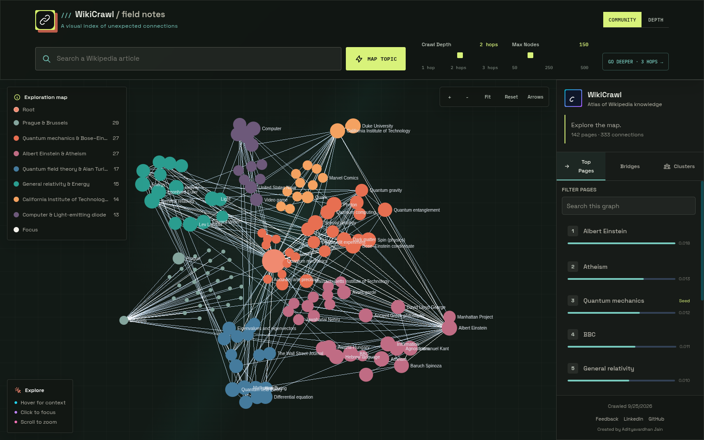
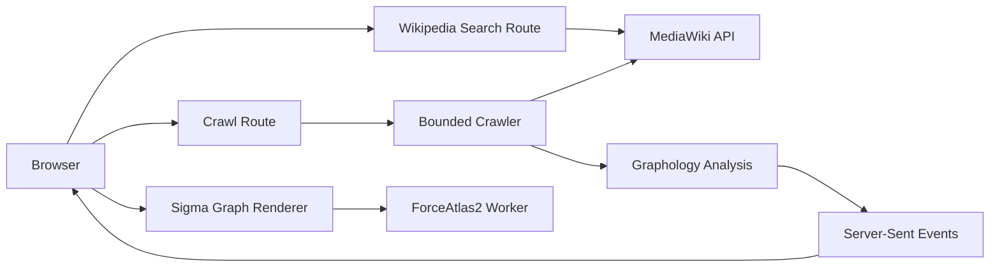

# WikiCrawl

**Turn Wikipedia into an interactive map of knowledge.**

WikiCrawl transforms the links surrounding a Wikipedia article into an interactive, explorable graph. Search for a topic, watch the crawl unfold in real time, and discover how articles connect across Wikipedia.

[**Try WikiCrawl**](https://wiki-crawl.vercel.app) · [Report a Bug](https://github.com/Adityavardhanjain/WikiCrawl/issues) · [View Source](https://github.com/Adityavardhanjain/WikiCrawl)

 



## Overview

Wikipedia contains millions of interconnected articles. WikiCrawl makes those connections tangible by turning article links into a graph you can navigate, analyze, and explore.

Starting from a Wikipedia article, WikiCrawl follows outgoing links up to a configurable depth, constructs a directed graph, and streams results to the browser as the crawl progresses.

### Features

* **Live crawling:** Watch pages, connections, and crawl progress appear as results arrive.
* **Configurable exploration:** Choose a starting article, a crawl depth of 1–3 hops, and a page limit between 50 and 500.
* **Interactive graph visualization:** Navigate the graph with zoom, fit-to-view, reset, and edge-display controls.
* **Community and depth coloring:** Color nodes by detected community or distance from the starting article.
* **Page inspection:** Select a node to explore its summary, graph metrics, community assignment, and connected pages.
* **Incremental expansion:** Crawl outward from a selected page and merge newly discovered pages into the existing graph.
* **Deeper exploration:** Restart from the original seed with a greater crawl depth and a chosen page limit.
* **Shortest-path discovery:** Find a shortest route between pages already present in the graph.

Graph metrics and community assignments are calculated over the crawled subgraph, not the entirety of Wikipedia. Although crawl edges preserve link direction, shortest-path search treats connections as undirected.

## Architecture

WikiCrawl combines a bounded Wikipedia crawler, graph analysis, server-sent events, and an interactive graph renderer.

### Request and data flow



### How it works

**1. Search and discovery**

The browser sends a search request to the search API, which queries the MediaWiki API to find matching Wikipedia articles.

**2. Bounded crawling**

The crawler retrieves article links in batches and follows MediaWiki continuation tokens. It normalizes titles, resolves redirects, avoids duplicate nodes, filters noisy titles, and enforces request and concurrency limits.

When available, pageview data helps prioritize candidate pages. If pageview data is unavailable, the crawler uses a deterministic ordering based on the seed.

**3. Graph construction and analysis**

Discovered articles and their connections form a directed graph. Graphology is used to calculate graph metrics and community assignments over the resulting subgraph.

**4. Live streaming**

During an initial crawl, nodes, edges, progress, and analysis results are streamed to the browser using server-sent events (SSE). The client applies updates incrementally to its Graphology graph.

**5. Interactive visualization**

Sigma renders the graph in the browser. ForceAtlas2 runs in a worker, keeping graph layout computation off the main UI thread.

### Incremental expansion

Expanding a selected node is a separate operation from increasing the depth of the original crawl.

The expansion request sends known node IDs and edges as index pairs. This avoids resending a verbose list of edge objects and allows the server to recalculate graph metrics for the combined graph.

The server returns the newly discovered graph data as a delta, which the client merges into the existing graph.

## Resource Limits and Failure Handling

WikiCrawl places explicit limits on crawling and API usage to keep requests bounded and protect the application from excessive resource consumption.

| Resource                         |                                                       Limit |
| -------------------------------- | ----------------------------------------------------------: |
| Crawl depth                      |                                                    1–3 hops |
| Requested page limit             |                                                      50–500 |
| Crawler traversal request budget |                                       500 upstream requests |
| Crawler concurrency              |                                                           3 |
| Wikipedia link request timeout   |                                                  10 seconds |
| Browser summary request timeout  |                                                   8 seconds |
| Expansion payload                |                                  500 nodes and 50,000 edges |
| Search API rate limit            |              120 requests per client address per 10 minutes |
| Concurrent upstream searches     |                                      100 per server process |
| Crawl API throttle               | 60 requests per client address per rolling 10-minute window |

The crawler's request budget applies after the crawl route's separate seed-page validation request.

### Partial results and errors

A crawl can return a partial graph if Wikipedia is unavailable, rate-limits requests, or the crawler exhausts its request budget. Where known, the UI reports unavailable pages.

Unexpected rendering errors display a route-level retry screen. Errors in the root layout have a separate global fallback. Expected crawl and network errors are handled through the application's normal inline error states.

### Rate limiting

The crawl throttle uses an in-process sliding-window counter. Client addresses are determined using `x-real-ip`, followed by the last address in `x-forwarded-for`.

Reverse proxies must overwrite or correctly append these headers. Since counters are maintained separately by each server process or serverless instance, this mechanism provides basic abuse protection rather than a globally enforced quota.

For deployments requiring distributed rate limiting, use a shared store at the edge or a service such as Redis.

The search route uses the same client-address precedence and per-process limitations. Identical in-flight queries share a single upstream request. When the 100-search concurrency limit is reached, the route returns `503 Service Unavailable` with a `Retry-After` header.

## Caching and Persistence

WikiCrawl caches page links, pageview data, and completed crawl results to reduce repeated work and upstream API requests.

### Storage backends

* **SQLite:** Used when the `better-sqlite3` native binding loads successfully and the configured database path is writable.
* **In-memory fallback:** Bounded in-process memory caches are used when SQLite is unavailable.

A cache failure should not prevent crawling when the memory-cache fallback is available.

Memory-cache entries are local to a process and are lost when that process stops.

### Database location

| Environment       | Default database path |
| ----------------- | --------------------- |
| Local development | `./wiki-crawl.db`     |
| Vercel            | `/tmp/wiki-crawl.db`  |

On Vercel, the `/tmp` filesystem is ephemeral and is not shared between function instances.

**Important:** Caches are performance optimizations, not durable storage. WikiCrawl does not rely on cached data as permanent application state.

## Getting Started

### Prerequisites

* [Node.js 22](https://nodejs.org/)
* npm
* Network access to Wikipedia and Wikimedia APIs

### Installation

Clone the repository and install its dependencies:

```bash
git clone https://github.com/Adityavardhanjain/WikiCrawl.git
cd WikiCrawl
npm ci
```

Start the development server:

```bash
npm run dev
```

Open http://localhost:3000 in your browser.

### Production build

To test the production build locally:

```bash
npm run build
npm start
```

The application will be available at `http://localhost:3000`.

## Configuration

All environment variables are optional.

| Variable               | Description                                                            | Default                                                   |
| ---------------------- | ---------------------------------------------------------------------- | --------------------------------------------------------- |
| `WIKI_CONTACT`         | Contact information included in the Wikimedia API user agent           | Not set                                                   |
| `CRAWL_CONCURRENCY`    | Requested crawler concurrency, capped by the server at 3               | `3`                                                       |
| `WIKICRAWL_DB_PATH`    | SQLite database location                                               | `./wiki-crawl.db` locally; `/tmp/wiki-crawl.db` on Vercel |
| `NEXT_PUBLIC_SITE_URL` | Public origin used to construct absolute metadata and share-image URLs | `https://wiki-crawl.vercel.app`                           |

### Local environment

Create a `.env.local` file in the project root:

```env
WIKI_CONTACT=you@example.com
WIKICRAWL_DB_PATH=./wiki-crawl.db
NEXT_PUBLIC_SITE_URL=http://localhost:3000
```

Replace the contact value with your own contact information if you wish to provide it to Wikimedia.

### Metadata and assets

The favicon, Open Graph image, and Twitter image are generated by Next.js from files in `app/`. The project does not require a `public/` directory or checked-in image binaries for these assets.

## Testing and Quality Checks

Run the following commands before submitting changes or preparing a release:

```bash
npm test
npm run typecheck
npm run lint
npm run build
```

### Additional commands

```bash
npm run bench            # Crawl and performance benchmarks
npm run probe:wikipedia  # Inspect live Wikipedia API behavior
```

### Test coverage

The test suite includes crawler, API route, graph, component, and UI behavior tests.

SQLite-specific tests require the `better-sqlite3` native binding to load. In environments where the binding cannot load, those tests may fail even though the application can fall back to its in-memory cache.

### Continuous integration

GitHub Actions runs the following checks on pushes to `main` and pull requests:

1. Install dependencies using `npm ci`.
2. Run TypeScript type checking.
3. Run linting.
4. Execute the test suite.
5. Build the production application.

Workflow: [`.github/workflows/ci.yml`](.github/workflows/ci.yml)

## Project Structure

```text
WikiCrawl/
├── app/       # Next.js UI, API routes, error fallbacks, and metadata images
├── lib/       # Wikipedia client, crawler, graph analysis, cache, and utilities
├── types/     # Shared graph types
├── tests/     # API, crawler, component, and performance tests
├── docs/      # Wikipedia API investigation notes and preview assets
├── scripts/   # Wikipedia API probe and related scripts
└── README.md
```

## Contributing

Contributions, bug reports, and suggestions are welcome!

If you encounter a bug or have an idea for improving WikiCrawl:

1. Check the [existing issues](https://github.com/Adityavardhanjain/WikiCrawl/issues).
2. Open an issue describing the problem or proposed improvement.
3. For code contributions, fork the repository and submit a pull request.

Please run the project's tests and quality checks before submitting a pull request.

## License

WikiCrawl is released under the MIT License. See [`LICENSE`](LICENSE) for details.
